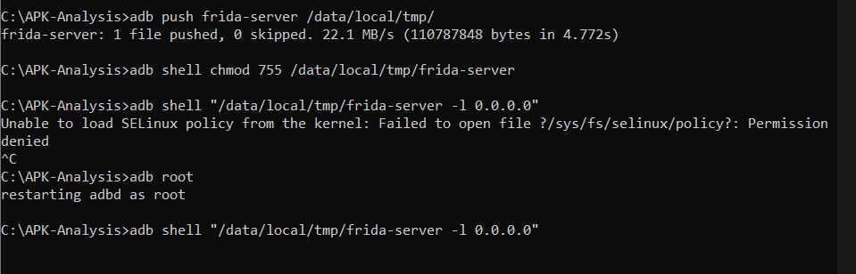
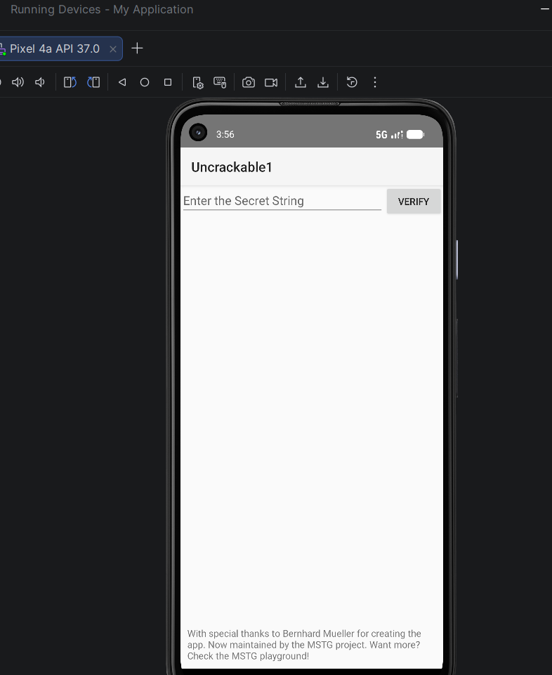
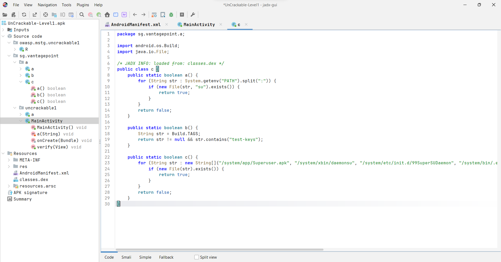
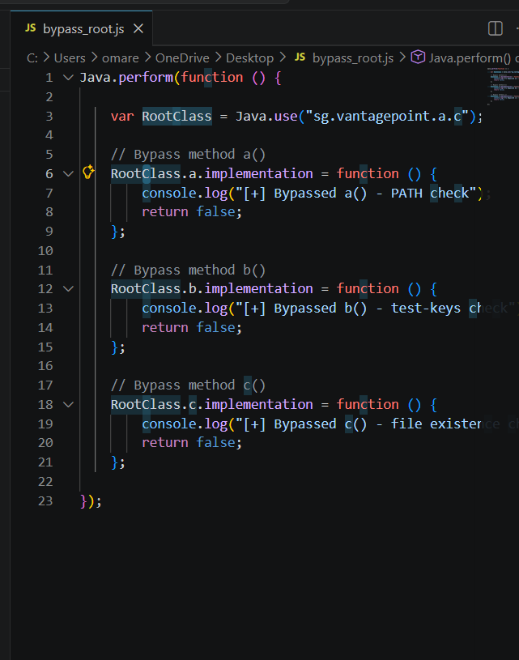
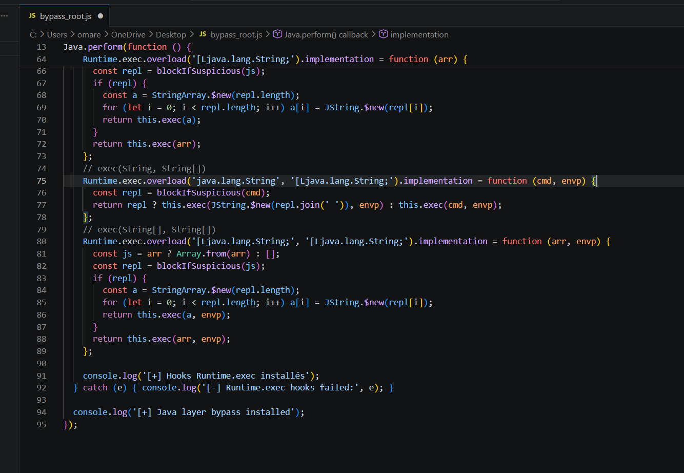
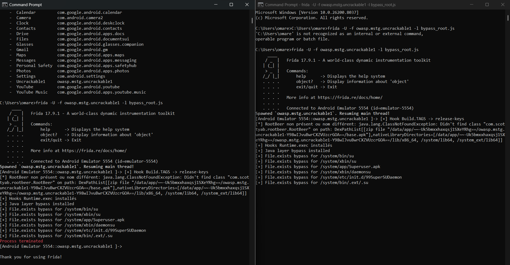

# LAB 11 — Bypass de la Détection de Root Android avec Frida

**Cours :** Sécurité des applications mobiles  
**Analyste :** Omar Haouani  
**APK cible :** UnCrackable-Level1.apk  
**Outil :** Frida 17.9.1  
**Date :** Avril 2026

---

## Phase 1 : Installation de Frida Server

## Phase 2 : Interface de l'application

## Phase 3 : Analyse JADX - Code anti-root

## Phase 4 : Script Frida - Hook des méthodes anti-root

## Phase 5 : Script Frida - Hook de Runtime.exec

## Phase 6 : Exécution du script Frida

---

## Résultats

| Détection | Statut |
|-----------|--------|
| Méthode a() | Bypassée ✅ |
| Méthode b() | Bypassée ✅ |
| Méthode c() | Bypassée ✅ |

---

*Omar Haouani - 2026*
